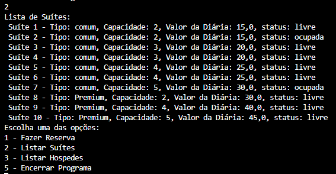

# DIO - Trilha .NET - Explorando a linguagem C#

## Objetivo deste Projeto:
>Ele foi criado como um desafio de projeto para o **Bootcamp Pottencial .NET Developer** da plataforma DIO ( *O segundo deles* ).
O foco é utilizar os aprendizados de C# e .NET do módulo "explorando a linguagem C#": construtores, coleções, exceções, operador ternário, nuget e serialização.

## Contexto
>Você foi contratado para construir um sistema de hospedagem, que será usado para realizar uma reserva em um hotel. Você precisará usar a classe Pessoa, que representa o hóspede, a classe Suíte, e a classe Reserva, que fará um relacionamento entre ambos.

>O seu programa deverá cálcular corretamente os valores dos métodos da classe Reserva, que precisará trazer a quantidade de hóspedes e o valor da diária, concedendo um desconto de 10% para caso a reserva seja para um período maior que 10 dias.

## Regras e validações
> 1. Não deve ser possível realizar uma reserva de uma suíte com capacidade menor do que a quantidade de hóspedes. Exemplo: Se é uma suíte capaz de hospedar 2 pessoas, então ao passar 3 hóspedes deverá retornar uma exception.
> 2. O método ObterQuantidadeHospedes da classe Reserva deverá retornar a quantidade total de hóspedes, enquanto que o método CalcularValorDiaria deverá retornar o valor da diária (Dias reservados x valor da diária).
> 3. Caso seja feita uma reserva igual ou maior que 10 dias, deverá ser concedido um desconto de 10% no valor da diária.

## Solução
>O código está pela metade, e você deverá dar continuidade obedecendo as regras descritas acima, para que no final, tenhamos um programa funcional. Procure pela palavra comentada "TODO" no código, em seguida, implemente conforme as regras acima.

## Aprimoramentos

>Ao concluir o que a tarefa pedia, implementei um sistema que permite a realização de tarefas

- [x] Menu com opções de tarefas, finalizando apenas ao pedir para encerrar programa.
- [x] Classe Hotel que tem sa listas de hospedes e de suites
- [x] Suites registradas através de um Json com as informações sobre cada uma delas (Usando o Newtonsoft.Json )
- [x] Cadastro de reservas pedindo nome, quantidade de dias e numero da suite com uso de Try e Catch.
- [x] Listar as suites com seus valores, capacidades e indicativo se estão ocupadas ou livres.

## Status do Projeto
> Concluído
